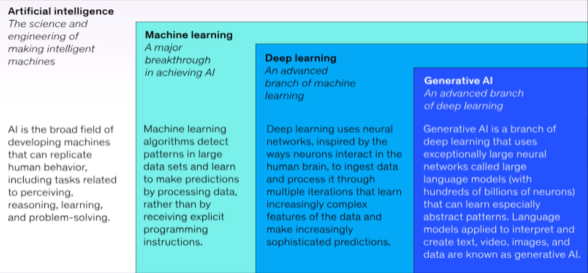
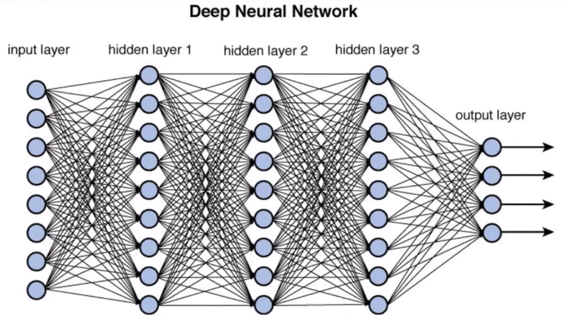
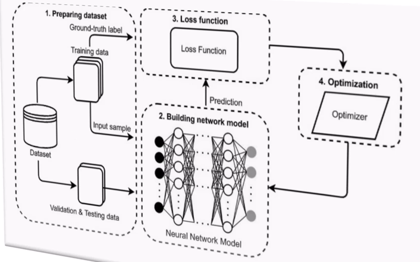
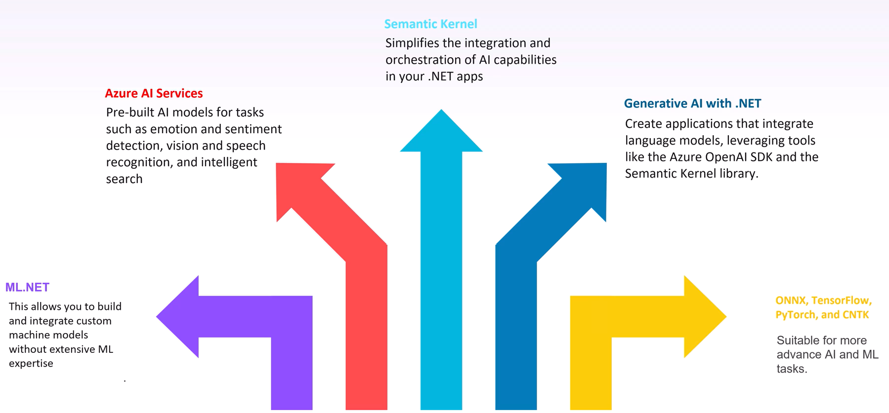

# Generative AI for NET

## **Introduction to Machine Learning & AI**

**Artificial Intelligence** is a set of technologies that enable computers to perform human-like tasks:

- It performs **cognitive functions** we usually associate with human minds.
- **AI** is an *umbrella term* for any theory, computer system or software developed to allow machines to perform tasks that normally require human intelligence.

<div style="text-align:center; margin: auto;">
</div>
<div style="page-break-after: always;"></div>

### Machine Learning

Machine Learning is a form of artificial intelligence that is able to learn without explicit programming by humans.
Some machine **learning algorithms** are specialized in training themselves to detect patterns (**Deep Learning**).\
Uses:

- **Image Recognition**
- **Natural Language Processing**
- **Recommendation Systems**
- **Predictive Maintenance** (predict equipment failures before they happen)

### Introduction to Generative AI

Generative AI is artificial intelligence capable of creating new content using models trained on existing data (it generates text, images, audio and video).\
Powered by advanced **Machine Learning Models** such as:

- *Trasformers*
- *GANs* (**Generative Adversarial Networks**)
- Others

### Generative AI isn't

- Fully Autonomous
- Free from Bias
- Always accurate
- A replacement for humans

### Ethical Implications AI

AI has the potential to unlock all kinds of opportunities (good or bad) for businesses, governments and society:

- Non-discrimination
- Fairness
- Human Rights
- Environmental Impact
- Accountability
- Privacy and Data Protection

### Generative AI best practices

- Be aware of biases, inaccuracies, and ethical concerns.
- Always validate the AI-generated output, especially in critical applications.
- Ensure compliance with privacy laws, as generative models often use large datasets.
- Make it clear when content is AI-generated to avoid confusion or misinformation.
- Avoid using generative Al for malicious purposes, such as deep fakes or misleading information.

## Machine Learning Basics

**Training Set**:

- Used to train the Machine Learning Models.

**Validation Set**:

- Used to tune the model's hyperparameters and prevent overfitting.

**Test Set**:

- Used to evaluate the final performance of a Machine Learning Model.

### Types of Machine Learning

- **Supervised Leaning** (labeled data)
- **Unsupervised Leaning** (unlabeled data)
- **Semi-Supervised Leaning** (labeled & unlabeled data)
- **Reinforcement Learning** (trial & error learning process with reward)

### Machine Learning Models

- **Generative ADversarial Networks** (GANs):
  - Used primarily for generating synthetic data.
- **Variational AutoEncoders** (VAEs):
  - Used for generating new data.
- **AutoRegressive Models** (AR):
  - Statistical model used for analyzing and predicting time series data.

### **Neural Networks**

Neural Networks are computational models designed to recognize patterns and make decisions based on data.

Training a Neural Network is the process of using training data to find the appropiate weights of the network for creating a good mapping of inputs and outputs
<div style="text-align:center; margin: auto;">


</div>

## ML.NET

**ML.NET** is an open-source, cross-platform Machine Learning Framework for .NET:

- Allows you to apply your existing .NET skills and use the tools you're familiar with (like Visual Studio) to train **Machine Learning Models**.
- **Model Builder** is a **Graphical Visual Studio Extension** to train and deploy custom Machine Learning Models by using ML.NET:
  - Uses **Automated Machine Learning** (AutoML) to find the *best Model* for your Data.
  - This automates the process of applying Machine Learning to Data.

<div style="text-align:center; margin: auto;">

</div>

### Data Preparation & Loading

The first step to train a Machine Learning Model is deciding which scenario and Machine Learning Task are the most appropriate for the solution:

- **Categorizing Data** (organize news article by topic)
- **Predicting a Numerical Value** (estimate price of a home)
- **Grouping Items with similar Characteristics** (segment customers)
- **Classifying Images** (tag an image based on its contents)
- **Recommending Items**
- **Detecting Objects in an Images** (detect pedestrians at an intersection)

The **scenarios** map to **Machine Learning Task**:

- A Machine Learning Task is the type of prediction/inference being made, based on the problem or question and the available data.
- With your scenario and training environment selected, it's time to load and prepare your data:
  - Choose your data source type.
  - Provide the location of your data.
  - Choose **Column purpose**:
    - You must define the purpose of certain columns.
    - In scenarios like data Classification and Value Prediction, you choose which of your coumns is the column that you want to predict (label).
    - All other columns that are not the label are used as features.
    - **Freatures** are **columns** used as inputs to **predict** the label.

Depending on your scenario, Model Builder supports loading data from the following sources:

- **Delimited files** (comma, semicolon, tab)
- Local/Remote **SQL Server Databases**
- **Images**

**Training** in Model Builder:

- Training consists of applying algorithms for the chosen scenario to your dataset to find the **best model**.
- To train **Machine Learning Models** in Model Builder, you only must provide the time you want to train for:
  - Dataset-> ```0 MB``` to ```10 MB```: 10 seconds
  - Dataset-> ```10 MB``` to ```100 MB```: 10 minutes
  - Dataset-> ```100 MB``` to ```500 MB```: 30 minutes
  - Dataset-> ```500 MB``` to ```1 GB```: 60 minutes
  - Dataset-> ```1 GB+```: 3+ hours
- Longer training periods allow Model Builder to explore more models with a wider range of settings.
- Model Builder uses **AutoML** to know the tranformations to prepare your data for training, select an algorithm and tune the **hyperparameters** of the algorithm.
- By using evaluation metrics that are specific to the selected Machine Learning Task, Model Builder can determine which model performs best for your data.

## Generative AI

**Artificial Intelligence** (AI) imitates human behavior by using Machine Learning to interect with the environment and execute tasks without explicit directions on what to output:

- Generative AI descrives a category of capabilities within AI that create original content.
- Generative AI applications accept *natural language* input and return appropiate responses in natural language, images or code.

**Generative AI** application are powered by **Language Models**:

- Specialized Machine Learning Model that you can use to perform **Natural Language Processing** (NPL) tasks.
- It's more practical to use an existing foundation model, and optionally fine-tune it with your training data otherwise you can train the Language Models from scratch.
- **Language Models** can be considered in two categories:
  - **Large Language Models** (LLMs):
    - Trained with vast quantities of text that represents a wide range of general subject matter.
  - **Small Language Models** (SLMs):
    - Trained with smaller, more subject-focused datasets.

## Microsoft Azure AI Services

### Microsoft Azure

**Microsoft Cloud Computing Platform**, providing services like computing, networking, storage and databases. It offers seamless hybrid Cloud solutions and provides easy scalability.
Azure includes built-in **AI** and **Machine Learning** services like **Azure Machine Learning**, **Cognitive Services** and **Bot Services** for developing intelligent applications.

The primary resouce required for **Azure Machine Learning** is an **Azure Machine Learning Workspace**, which you can deploy in an **Azure subscription** (to create an Azure Machine Learning Workspace use the **Azure portal**).
**Azure Machine Learning Studio** is a cloud-based platform that simplifies Machine Learning Development:

- after you deploy an **Azure Machine Learning Workspace**, you use it in **Azure Machine Learning Studio**, a browser-based portal for managing your Machine Learning Resources and Jobs.

### Azure AI Services

**Azure AI Services** are built to scale globally (deploying models in the Cloud or at the Edge) and offers several **pre-built models** that developers can easily integrate into their applications:

- Azure AI provides tools and frameworks ensuring fairness, transparency and accontability in AI Model Development.

**Azure AI Services** provides a suite of tools for building, deploying and managing **AI models** including:

- **Azure Machine Learning**:
  - **Cloud-based** service that allows to build, train and deploy **Machine Learning Models**.
  - It supports Python, R, TensorFlow, PyTorch, etc.
- **Azure Cognitive Services**
  - Collection of *pre-built APIs* that enable develoers to integrate vision, speech, language, decision-making and search capabilities into their application (*Computer Vision*, *Speech-to-Text*, *Text Analytics*).
- **Azure OpenAI**:
  - On **Microsoft Azure**, foundation models are found in the **Azure OpenAI service** and the **Model Catalog** (curated source of pre-trained models). Using these models from the Azure OpenAI service means that you also benefit from a secure, scalable Azure Cloud Platform in which the models are hosted.
  - Offers acccess to **Language Models** to develop intelligent applications (Chatbots, Content Generation, Language Translation).
- **Natural Language Processing NPL**:
  - Azure provides robust NLP capabilities, allowing developers to analyze text, extract insights and perform sentiment analysis through services (*Text Analytics*, *Language Understanding* LUIS).
  - **Natural Language Processing** is the application of computational techniques to the analysis and synthesis of natural language and speech.
  - Using text analytics, translation and language understanding services Microsoft Azure makes building applications that support natural language easy (*Sentiment Analysis*).
  - **Text Classification**:
    - **Tokenization**:
      - Statistical analysis of a body of text (a corpus) to infer semantic meaning.
      - The first step in analyzing a corpus is to break it down into tokens or each distinct word in the training text.
      - Tokens can also be generated for partial words or combinations of words and punctuation.
      - After tokenizing the words, you can perform some analysis to count the number of occurrences of each token.
    - **Classification Algorithm**:
      - Another text analysis technique is to use a **Classification Algorithm** (*Logistic Regression*) to train a **Machine   Learning Model** that classifies text based on a known set of categorizations.
      - With enough **labeled reviews**, you can train a **Classification Model** using the **Tokenized Text** as **Features** and   the **Sentiment** (0 or 1) a label.
    - **Sematic Language Models**:
      - At the heart of these models is the encoding of **language tokens** as **vectors** (multi-valued arrays of numbers) known   as **embeddings**:
        - Think of the elements in a **token embedding vector** as **coordinates** in **multidimensional space** so that each   token occupies a specific "*location*".
        - The closer tokens are to one another along a particular dimension, the more semantically related they are.
    - **Logistic Regression**:
      - Train a Machine Learning Model that classifies text based on a known **set** of **categorizations**.
      - With enough labeled reviews, you can train a classification model using the tokenized text as features and the sentimenti (0 or 1) a label.
  - **Text Analysis**:
    - **Azure AI Language** is a part of the Azure AI services offerings that can perform advanced natural language processing over unstructured text.
    - Azure AI Language's text analysis features include:
      - **Named Entity Recognition**: identifies people, places, events, and more.
      - **Personal Identifying Information (PII) Detection**: identifies personally sensitive information.
      - **Language Detection**: identifies the language of the text and returns a language code such as "en, it, etc."
      - **Sentiment Analysis & Opinion Mining**: identifies wheter text is positive or negative.
      - **Summarization**: summarizes text by identifying the most important information.
      - **Key Phrase Extraction**: lists the main concepts from unstructured text.
- **AI for Conversational Bots**
- **Custom Vision**:
  - Computer Vision is an area of AI where systems are designed to perceive the world through cameras, images and video.
  - Multiple computer vision problems can be solved using a mix of custom Machine Learning Models and many AI services in Microsoft Azure:
    - **Azure AI Vision**:
      - Creates intelligent solutions that extract information from images.
    - **Azure AI Face**:
      - Makes integrating these capabilities into your application easy.
    - **Optical Character Recognition** (OCR):
      - Enables AI systems to read text in images, enabling applications to extract information form photo, scanned documents or other digitized text.
  - **ML Image Processing**:
    - To a computer, an image is an **array** of **numeric pixel values** that consists of 7 rows and columns (7x7 image resolution).
    - **Each pixel** has a value between **0** (black) and **255** (white) (grey otherwise).
    - The goal is to extract meaning/least actionable insights form images.
    - One of the most common Machine Learning Model achitectures for Computer Vision is a **Convolutional Neural Network** (CNN):
      - **CNNs** use **filters** to extract **numeric feature maps** from images and then feed the values into a **Deep Learning Model** to generate a **label prediction**.
      - During the **training process** for a CNN, **filter kernels** are initially defined using **randomly generated weight** values, then as the training progresses, the model predictions are evaluated against known label values and the filter weights are adjusted to improve accuracy.
      - **Filters** modify the **image's pixel values** to create a visual effect:
        - A filter is one or more arrays of pixel values called filter kernels.
        - Because the filter is convolved across the image, this kind of **image manipulation** is often referred to as **Convolutional Filtering**.

        <div style="text-align:center; margin: auto;">
        </div>
        <div style="page-break-after: always;"></div>

      - **Transformers**:
        - CNNs are further enhanced using **transformers** based on **NLP principles**.
        - **Transformers** work by processing huge volume of data and **encoding language tokens** (representing individual words or phrases) as **vector-based embeddings** (arrays of numeric values), representing a set of dimensions representing some semantic attribute of the token:
          - The **embeddings** are created such that **commonly used tokens** in the **same context** are **closer** together dimensionally than unrelated words.
        - The successful use of transformers led to use the same approach for **image data**.
        - The result is the development of **Multi-Model Models**, where the model is trained using a large volume of captioned images with **no fixed labels**:
          - An **image encoder** extracts features from images based on **pixel values** and combines them with **text embeddings** created by a **language encoder**.
          - The overall **model encapsulates** relationships between **natural language token embeddings** and **image features**.
          - The **Microsoft Florence Model** is an example of a foundation model that includes both a **Language Encoder** and an **Image Encoder** on which you can build multiple adaptive models for tasks like:
            - **Image Classification**
            - **Object Detection**
            - **Captioning**
            - **Tagging**
- **Document Intelligence**:
  - Document processing using **Azure AI Document Intelligence** allows you to automate **Data Extraction** across document types (receipts, invoices and more) that relies on Machine Learning Models trained to recognize text data.
  - The ability to extract text, layout, and key-value pairs is known as **Document Analysis**:
    - Document analysis provides locations of text on a page identified by **bounding box coordinates**.
  - **Azure AI Document Intelligence** consists of features grouped by model type:
    - **Document Analysis**
    - **Prebuild Models**
    - **Custom Models**
- **Speech Services**
- **AI-Powered Search**
- **Form Recognizer**

### Azure Machine Learning

**Azure Machine Learning** is a cloud-based service that steamlines the Machine Learning Process, allowing users to focus on building and deploying intelligent applications. It offers:

- **Storage & Management**: centralized storage and management of Datasets for Model Training and evaluation.
- **Computing resources**: on-demand computing resources on which you can run Machine Learning jobs.
- **Visual tools**: for defining orchestrated pipelines for processes such as Model Training or Inference.
- **Integration capabilities**: with popular Machine Learnig frameworks such us MLflow.
- **Built in support**: for visualizing and evaluating metrics for resposible AI, including model explainability.
- **Multiple training**: Automated Machine Learning which facilitates the execution of multiple training jobs with different algorithms.

### Azure OpenAI Services

**OpenAI** is an artificial intelligence research company producing services like *ChatGPT*.\
**Azure OpenAI Service** provides **REST API** access to OpenAI's powerful language models that performs tasks like:

- **Content Generation**
- **Summarization**
- **Image Understanding**
- **Semanctic Search**
- **Natural Language to Code Translation**

Users can access the service through REST APIs, SDKs or in the **Azure AI Studio** (**Azure OpenAI** *co-develops* the **APIs** with **OpenAI**).\
**Azure OpenAI Models** can help identify ways to improve and provide suggestions on how to write better code (*GitHub Copilot*).

**Code Generation/Assistance**:

- **Azure OpenAI** has Models to generate code from **Natural Language Prompts** (full application or one-line command).
- **AI Models** can also **edit** and **update** the provided code or previous responses to complete the requested task.
- The models can generate functions and apps in several languages and they are helpful for understanding code.

**Coding Assistance**:

- **AI Assistance** can enable developers to spend more time on complex programming and problem-solving tasks like:
  - **Generate documentation**: AI models can add comments and documentation.
  - **Write unit tests**
  - **Complete partial code**: AI models can generate code based on comments, function names and partially written code.

**Image Generation**:

- **DALL-E** is an **Image Generation Model** that can create original graphical content based on natural language descriptions of a desired image.
- The images generated by DALL-E are original, **DELL-E** is a **Neural Network-based Model**, not a search system for finding appropiate images.
- You can use the Azure OpenAI service REST API to consume DALL-E models from applications:
  - You initiate the image generation process by submitting a POST request to the service endpoint with the authorization key in the header.
  - The request must contain the following parameters in a JSON body:
    - ```prompt```: the image generation request.
    - ```n```: the number of images to be generated.
    - ```size```: the resolution of the images to be generated.
    - ```quality```: standard or HD (optional, defaults is standard).
- The **response** contains a data element with the **url** to a **PNG image** file generated from the prompt:
  - the **response** also contains a **revised prompt**, that was used to generate the image (updated by the system).

**Retrieval Augmented Generation RAG**:

- **Retrieval Augmented Generation RAG** combines **LLMs** with external knowledge bases to improve their outputs.
- **RAG** with **Azure OpenAI** allows developers to use supported **AI Chat Models** that can reference specific sources of information.

## SETUP PREDICTIVE MODEL

### Visual Studio 2022

- **Create a new Project**
  - **Console App**:
    - Create a new Console App project, e.g., `MLProject.Console`
    - Inside the project, go to `Add -> Machine Learning Model...`
    - Select **Machine Learning Model (ML.NET)** (default option)
    - Click **Add**: this will generate a new file in the solution named `xxx.mbconfig`
- **Model Setup**
  - **Scenario**: Data Classification
  - **Environment**: Local (CPU)
  - **Data (for training)**:
    - Add the downloaded `.csv` file (training dataset)
    - Column to predict (label): **Machine failure**
    - Click **Start Training**
    - **Advanced training options**:
      - Used to retrain the model
      - Allows tuning **hyperparameters** to avoid **overfitting** or **underfitting**
  - **Evaluate**:
    - Displays model evaluation metrics such as *accuracy*, *precision*, *recall*, and *F1-score*
    - Allows comparison between different models to choose the best one
  - **Consume**:
    - Automatically generates C# code to use the trained model
    - Creates a class to load the model and make predictions on new data

---

### Visual Studio Code (ML.NET CLI)

- **Install ML.NET CLI Tool**
  - **Linux**

    ```bash
    dotnet tool install -g mlnet-linux-x64      # for 64-bit systems  
    dotnet tool install -g mlnet-linux-arm64    # for ARM64 systems
    ```

  - **macOS**

    ```bash
    dotnet tool install -g mlnet-osx-x64        # for 64-bit systems  
    dotnet tool install -g mlnet-osx-arm64      # for ARM64 systems
    ```

  - **Windows**

    ```bash
    dotnet tool install --global mlnet-win-x64     # for 64-bit systems  
    dotnet tool install --global mlnet-win-arm64   # for ARM64 systems
    ```

- **Train the model via terminal**

  ```bash
  mlnet classification --dataset "data.csv" --label-col 8 --has-header true --name PredictiveModel --train-time 10
  ```

  - `--dataset`: path to the dataset to be used  
  - `--label-col`: index of the column to be predicted (target/label)  
  - `--has-header`: indicates whether the dataset includes a header row  
  - `--name`: name for the generated ML model and related assets  
  - `--train-time`: number of seconds for ML.NET to explore and train models  

### Azure AI

#### Sentiment Language Analysis

- Create Dir: AzureAILanguageDemo

  ```console
  C:\Projects\AzureAILanguageDemo> dotnet new console
  C:\Projects\AzureAILanguageDemo> code .
  C:\Projects\AzureAILanguageDemo> dotnet add package Azure.AI.TextAnalytics
  ```

  ```Csharp
    //Setting an Sentiment Language Analysis Console-Application
    //From Microsoft Azure Language Studio
    string endpoint = "https://az-language-chabby.cognitiveservices.azure.com/";
    string key = "6aEfUvtUIEdê10GyuuvG7zmoUEêh10u1Z5veF15D8zb1xHEAiRjRJQQ";

    AzureKeyCredential azureKeyCredential = new AzureKeyCredential(key);
    Uri languageEnpoint = new Uri(endpoint);
    var client = new TextAnalyticsClient(languageEnpoint, azureKeyCredential);

  ```

#### Vision Caption Analysis

- Create Dir: AzureVisionCaptionDemo

  ```console
  C:\Projects\AzureVisionCaptionDemo> dotnet new webapp
  C:\Projects\AzureVisionCaptionDemo> code .
  C:\Projects\AzureVisionCaptionDemo> dotnet add package Azure.AI.Vision.ImageAnalysis
  ```

  ```Csharp
  // Index.cshtml.cs
  public async Task<IActionResult> OnPostAsync()
  {
    //Setting an Image Classification Analysis Web-Application
    //From Microsoft Azure Vision Studio
    string endpointUrl = "https://test-vision-chabby.cognitiveservices.azure.com/";
    string key = "6aEfUvtUIEdê10GyuuvG7zmoUEêh10u1Z5veF15D8zb1xHEAiRjRJQQ";
    ImageAnalysisClient azureClient = new(new Uri(endpointUrl), new AzureKeyCredential(key));

    if (input.Image != null)
    {
      using MemoryStream ms = new MemoryStream();
      await Input.Image.CopyToAsync(ms);
      ms.Position = 0;
      Input.ImageData = Convert.ToBase64String(ms.ToArray());

      ImageAnalysisResult imageAnalysisResult = await azureClient.AnalyzeAsync(
        //BinaryData.FromStream(ms),
        BinaryData.FromBytes(ms.ToArray()),
        VisualFeatures.Caption,
        new ImageAnalysisOptions { GenderNeutralCaption = false }
      );

      Input.ImageCaption = $"Caption: {imageAnalysisResult.Caption.Text} | Confidence: {imageAnalysisResult.Caption.Confidence}";
    }
    
    return Page();
  }
  ```

#### Document Intelligence Analysis

- Create Dir: AzureVisionDocumentIntelligenceDemo

  ```console
  C:\Projects\AzureVisionDocumentIntelligenceDemo> dotnet new webapp
  C:\Projects\AzureVisionDocumentIntelligenceDemo> code .
  C:\Projects\AzureVisionDocumentIntelligenceDemo> dotnet add package Azure.AI.FormRecognizer
  ```

  ```Csharp
  // Index.cshtml.cs
  public  AnalysisResult Result { get; set; } = new AnalysisResult();

  public async Task<IActionResult> OnPostAsync()
  {
    //Setting an Receipt Analysis Web-Application
    //From Microsoft Azure Document Intelligence Studio
    string endpointUrl = "https://test-vision-chabby.formrecognizer.azure.com/"; 
    string apikey = "6aEfUvtUIEdê10GyuuvG7zmoUEêh10u1Z5veF15D8zb1xHEAiRjRJQQ";
    AzureKeyCredential credential = new AzureKeyCredential(apikey);
    DocumentAnalysisClient client = new DocumentAnalysisClient(new Uri(endpointUrl), credential);

    //using (MemoryStream ms = new MemoryStream())
    //{
      //await Document.CopyToAsync(ms);
      //ms.Position = 0;
    //}
    using MemoryStream ms = new MemoryStream();
    await Document.CopyToAsync(ms);
    ms.Position = 0;

    AnalyzeDocumentOperation operation = await client.AnalyzeDocumentAsync(WaitUntil.Completed, "prebuild-receipt", ms);
    AnalyzeResult receipts = operation.Value;
    
    foreach (AnalyzedDocument receipt in receipts.Documents)
    {
      if (receipt.Fields.TryGetValue("MerchantName", out DocumentField merchantName))
      {
        if (merchantName.FieldType == DocumentFieldType.String)
        {
          string merchant = merchantName.Value.AsString();
          //ViewData["MerchantName"] = merchant;
          Result.MerchantName = $"Merchant Name: {merchant} with confidence: {merchantName.Confidence}"
        }
      }
      if (receipt.Fields.TryGetValue("Total", out DocumentField total))
      {
        if (total.FieldType == DocumentFieldType.Double)
        {
          float amount = total.Value.AsDouble();
          //ViewData["Total"] = amount;
          Result.Total = $"Total: {amount} with confidence: {total.Confidence}"
        }
      }
      if (receipt.Fields.TryGetValue("Items", out DocumentField itemsField))
      {
        if (itemsField.FieldType == DocumentFieldType.List)
        {
          foreach (DocumentField itemField in itemsField.Value.AsList())
          {
            string Description = string.Empty;
            string TotalPrice = string.Empty;

            if (itemField.FieldType == DocumentFieldType.Dictionary)
            {
              IReadOnlyDictionary<string, DocumentField> itemFields = itemField.Value.AsDictionary();

              if (itemFields.TryGetValue("Description", out DocumentField itemDescriptionField))
              {
                if (itemDescriptionField.FieldType == DocumentFieldType.String)
                {
                  string itemDescription = itemDescriptionField.Value.AsString();
                  Description = $"  Description: '{itemDescription}', with confidence {itemDescriptionField.Confidence}";
                }
              }
              if (itemFields.TryGetValue("TotalPrice", out DocumentField itemTotalPriceField))
              {
                if (itemTotalPriceField.FieldType == DocumentFieldType.Double)
                {
                  double itemTotalPrice = itemTotalPriceField.Value.AsDouble();
                  TotalPrice = $"  Total Price: '{itemTotalPrice}', with confidence {itemTotalPriceField.Confidence}";
                }
              }
            }
            Result.Items.Add((Description, TotalPrice));
          }
        }
      }
    }
    return Page();
  }

  public class AnalysisResult
  {
    public string MerchantName { get; set; } = string.Empty;
    public string TransactionDate { get; set; } = string.Empty;
    public List<(string desc, string total)> Items { get; set; } = [];
    public string Total { get; set; } = string.Empty;
  }
  ```

#### Azure OpenAI Machine Learning

- Create Dir: AzureOpenAIChatDemo

  ```console
  C:\Projects\AzureOpenAIChatDemo> dotnet new console
  C:\Projects\AzureOpenAIChatDemo> code .
  C:\Projects\AzureOpenAIChatDemo> dotnet add package Azure.AI.OpenAI --prerelease
  ```

  ```Csharp
    //Setting an Chatbot Machine Learning Console-Application
    //From Microsoft Azure OpenAI Studio
    string endpoint = "https://openai-demo-chabby.openai.azure.com/"; 
    string key = "6aEfUvtUIEdê10GyuuvG7zmoUEêh10u1Z5veF15D8zb1xHEAiRjRJQQ";
    AzureKeyCredential credential = new AzureKeyCredential(key);
    AzureOpenAIClient azureClient = new AzureOpenAIClient(new Uri(endpoint), credential);
    ChatClient chatClient = azureClient.GetChatClient("gpt-35-turbo.16k");

    //Setting up the "Persona" of the Assistant
    string systemMessage = "You are a senior developer with 50 years of .NET development experience.";

    do
    {
      Console.Write("Enter your promt ('quit' to exit); ");
      string? userPrompt = Console.ReadLine();

      ChatCompletion = completion = await chatClient.CompleteChatAsync(
        new SystemChatMessage(systemMessage),
        new UserChatMessage("Hi, can you help me?"),
        new AssistantChatMessage("Yes, of course! How can I mentor you today?"),
        new UserChatMessage(userPrompt)
      );
      Console.WriteLine($"{completion.Role}: {completion.Content[0].Text}");

    } while (string.IsNullOrEmpty(userPrompt) || userPrompt.Equals("quit"))
  ```

- Create Dir: AzureOpenAICodingAssistantDemo

  ```console
  C:\Projects\AzureOpenAICodingAssistantDemo> dotnet new console
  C:\Projects\AzureOpenAICodingAssistantDemo> code .
  C:\Projects\AzureOpenAICodingAssistantDemo> dotnet add package Azure.AI.OpenAI --prerelease
  ```

  ```Csharp
  //Setting an Chatbot Machine Learning Console-Application
  //From Microsoft Azure OpenAI Studio
  string endpoint = "https://openai-demo-chabby.openai.azure.com/"; 
  string key = "6aEfUvtUIEdê10GyuuvG7zmoUEêh10u1Z5veF15D8zb1xHEAiRjRJQQ";
  AzureKeyCredential credential = new AzureKeyCredential(key);
  AzureOpenAIClient azureClient = new AzureOpenAIClient(new Uri(endpoint), credential);
  ChatClient chatClient = azureClient.GetChatClient("gpt-35-turbo.16k");

  //Setting up the "Persona" of the Assistant
  string systemMessage = "You are a programming assistant who helps to write efficient code.";
  StringBuilder sb = new StringBuilder();

  do
  {
    Console.Write("Enter your promt ('quit' to exit); ");
    string? userPrompt = Console.ReadLine();

    sb.AppendLine(userPrompt);
    sb.AppendLine("---");
    var codeFile = File.ReadAllText("codeFile.txt");
    sb.AppendLine("---");

    ChatCompletion = completion = await chatClient.CompleteChatAsync(
      new SystemChatMessage(systemMessage),
      new UserChatMessage("Hi, can you help me?"),
      new AssistantChatMessage("Yes, of course! How can I help with your coding task today?"),
      new UserChatMessage(userPrompt)
    );
    Console.WriteLine($"{completion.Role}: {completion.Content[0].Text}");
    Console.WriteLine($"\nFull response: {JsonSerializer.Serialize(completion, new JsonSerializerOptions { WriteIndented = true })}\n\n");

  } while (string.IsNullOrEmpty(userPrompt) || userPrompt.Equals("quit"))
  ```

- Create Dir: AzureOpenAIDallEDemo

  ```console
  C:\Projects\AzureOpenAIDallEDemo> dotnet new webapp
  C:\Projects\AzureOpenAIDallEDemo> code .
  C:\Projects\AzureOpenAIDallEDemo> dotnet add package Azure.AI.OpenAI --prerelease
  ```

  ```Csharp
  //Setting DALL-E Machine Learning Web-Application
  //From Microsoft Azure OpenAI Studio
  // Index.cshtml.cs
  public string Prompt { get; set; }
  public string RevisedPrompt { get; set; }

  public async Task<IActionResult> OnPostAsync()
  {
    string endpoint = "";
    string apiKey = "";
    AzureOpenAIClient azureClient = new AzureOpenAIClient(new Uri(endpoint), new AzureKeyCredential(credential));

    ImageClient imageClient = azureClient.GetImageClient("dall-e-3");
    var imageGenerationResult = await imageClient.GenerateImageAsync(Prompt, new ImageGenerationOption {
      Size = GeneratedImageSize.W1024xH1024
    });

    ImageUrl = imageGenerationResult.Value.ImageUri.ToString();
    RevisedPrompt = imageGenerationResult.Value.RevisedPrompt;

    return Page();
  }
  ```

- Create Dir: AzureOpenAIRAGDemo

  ```console
  C:\Projects\AzureOpenAIRAGDemo> dotnet new console
  C:\Projects\AzureOpenAIRAGDemo> code .
  C:\Projects\AzureOpenAIRAGDemo> dotnet add package Azure.AI.OpenAI --prerelease
  ```

  ```Csharp
  //Setting an Chatbot Machine Learning Console-Application
  //From Microsoft Azure OpenAI Studio
  #pragma warning disable AOAI001 //Disabling specific warning AOAI001
  string endpoint = "https://openai-demo-chabby.openai.azure.com/";
  string key = "6aEfUvtUIEdê10GyuuvG7zmoUEêh10u1Z5veF15D8zb1xHEAiRjRJQQ";
  string azureSearchEndpoint = "https://ai-search-chabby.search.windows.net";
  string azureSearchKey = "6aEfUvtUIEdê10GyuuvG7zmoUEêh10u1Z5veF15D8zb1xHEAiRjRJQQ";
  string azureSearchIndex = "vector-1730843711600";

  AzureKeyCredential credential = new AzureKeyCredential(key);
  AzureOpenAIClient azureClient = new AzureOpenAIClient(new Uri(endpoint), credential);
  ChatClient chatClient = azureClient.GetChatClient("gpt-35-turbo.16k");
  ChatCompletitionOptions options = new ChatCompletitionOptions();
  options.AddDataSource(new AzureSearchChatDataSource(){
    Endpoint = new Uri(azureSearchEndpoint),
    IndexName = new Uri(azureSearchIndex),
    Authentication = DataSourceAuthentication.FromApiKey(azureSearchKey);
  });

  //Setting up the "Persona" of the Assistant
  string systemMessage = "You are a programming assistant who helps to write efficient code.";
  StringBuilder sb = new StringBuilder();

    Console.Write("Enter your question ('quit' to exit); ");
    string? userPrompt = Console.ReadLine();

    ChatCompletion completion = await chatClient.CompleteChatAsync(
      [
        new UserChatMessage(userPrompt)
      ],
      options
    );

    Console.WriteLine($"{completion.Content[0].Text}");
    ChatMessageContext chatContext = completion.GetMessageContext();
    if (chatContext?.Intent is not null)
    {
      Console.WriteLine($"Intent: {chatContext.Intent}");
    }

    foreach (ChatCitation citation in chatContext?.Citations ?? [])
    {
      Console.WriteLine($"Citation: {chatContext.Content}");
      Console.WriteLine($"Citation URL: {chatContext.Url}");
    }
  ```
